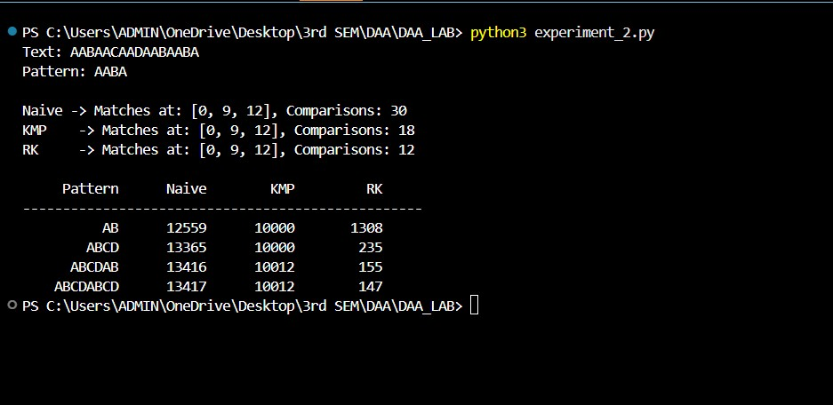
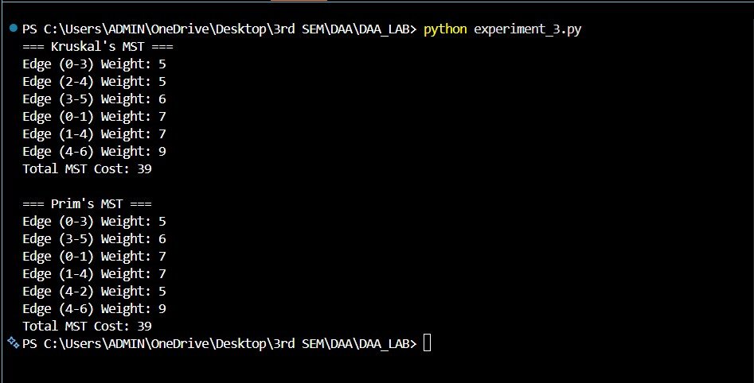
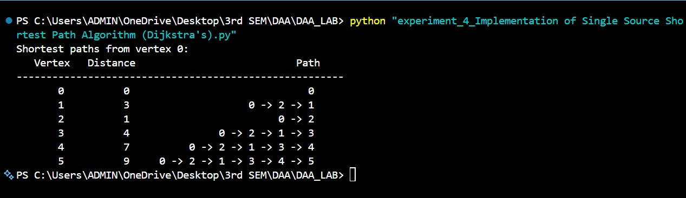
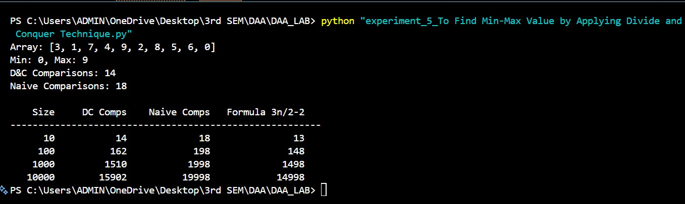
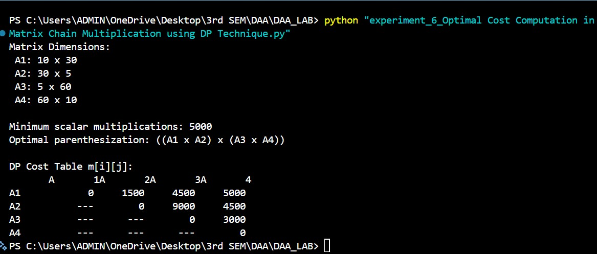
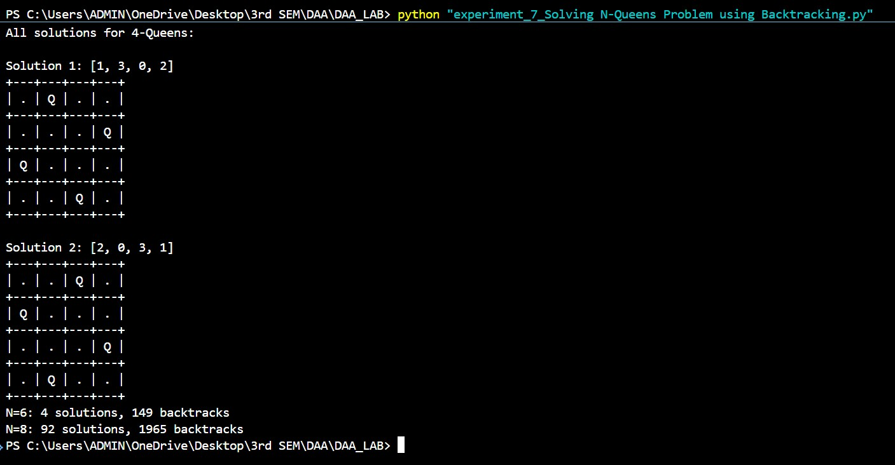
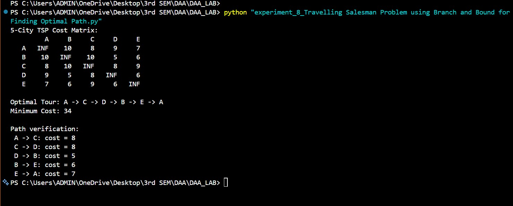
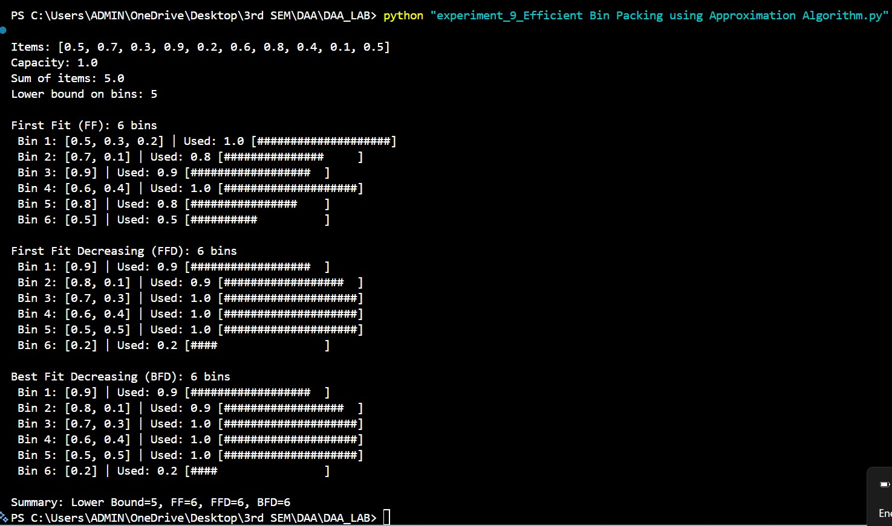
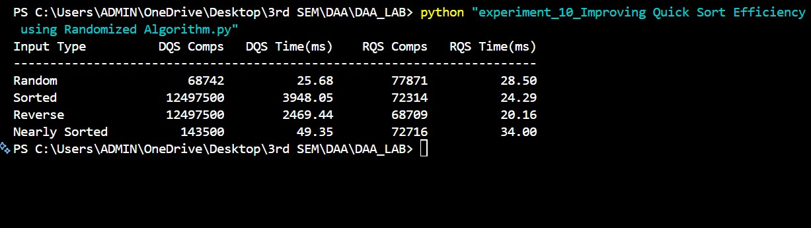

# CS5303 DAA Lab Outputs

* Experiment 1 – Implementation and Performance Analysis of Interpolation Search
  

* Experiment 2 – Comparative Analysis of Naive, Rabin-Karp, and KMP Algorithms for String Matching
  

* Experiment 3 – Implementation of Kruskal's and Prim's Algorithms for Minimum Spanning Tree
  

* Experiment 4 – Implementation of Single Source Shortest Path Algorithm (Dijkstra's)
  

* Experiment 5 – To Find Min-Max Value by Applying Divide and Conquer Technique
  

* Experiment 6 – Optimal Cost Computation in Matrix Chain Multiplication using DP Technique
  

* Experiment 7 – Solving N-Queens Problem using Backtracking
  

* Experiment 8 – Travelling Salesman Problem using Branch and Bound for Finding Optimal Path
  

* Experiment 9 – Efficient Bin Packing using Approximation Algorithm
  

* Experiment 10 – Improving Quick Sort Efficiency using Randomized Algorithm
  